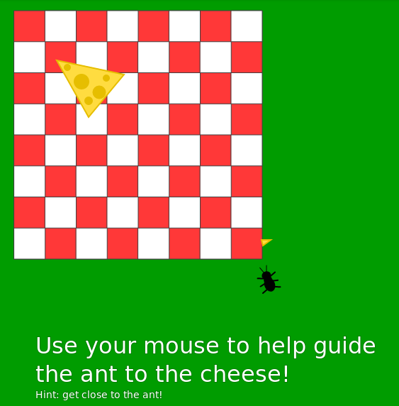

# cheesy-ant

Hello, I am a student at SFSU taking a Learning by Teaching class. I get to assist a teacher in the SFUSD. The class I TA for uses Processing and JavaScript ([p5.js](https://p5js.org/)).

This project is made to go along with one of the assignments for the class I TA for. It demonstrates the use of the `random()` function for moving the ant. It also uses `mouseX` and `mouseY` variables to influence the movement of the ant.

## Instructions

Get the mouse close to the ant to be able to help guide it towards the cheese.

